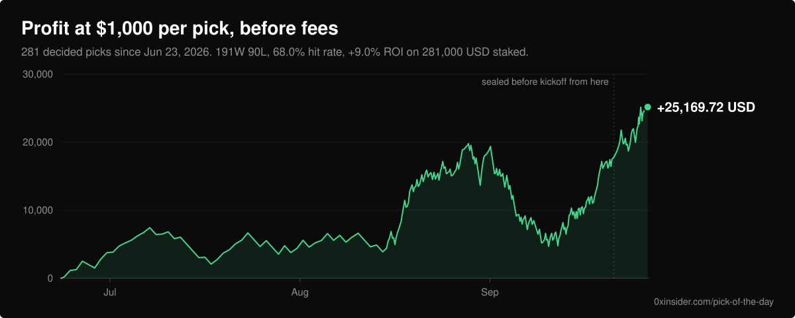

<!-- CHART:BEGIN -->
<a href="https://0xinsider.com/pick-of-the-day"></a>
<!-- CHART:END -->

# 0xinsider picks

Every [0xinsider Pick of the Day](https://0xinsider.com/pick-of-the-day), up to
6 a day, appears in this public ledger once the source publishes it. Some have
a hash in this repository from before kickoff; older and late entries do not.
The chart and the table below are recomputed
from the files in `ledger/` on every run, and `verify.py` checks all of it.

A pick is one Polymarket market, one side, and the price we backed it at. The
backend hashes those fields with a 32-byte nonce, 1 hour before kickoff, and the
hash lands here in a git commit. Its author date is controlled by the writer;
a workflow run's start time alone does not timestamp the hash. New Seal commits
also get a signed receipt for their exact commit SHA when the push succeeds.
Only a receipt independently witnessed before kickoff strengthens the timing
claim; an independently retained pregame copy does too. After the market
settles the nonce and the fields are appended, and the hash reopens for anyone
with `sha256sum`.

## Check it yourself

```
git clone https://github.com/0xinsider/picks && cd picks && python3 verify.py
```

Standard library only. No network, no credentials, no dependencies. Exit 0 means
every hash reopened, each late hash is disclosed and reviewed or covered by a
prior outage record, and the record below matches the raw data. The script's
timing comparison uses git author dates, which alone are not independent proof.
Exit 1 names the pick that failed and why.

Clone the full history. `--depth 1` disables the two checks that read git
history, and those are the ones that catch a backdated record.

## The record

<!-- RECORD:BEGIN -->
Record through 2026-09-25.

| | |
| --- | --- |
| Decided picks | 275 |
| Record | 187W 88L 0V |
| Hit rate | 68.0% |
| Modeled $1,000 per pick, before fees | +23,991.72 USD on 275,000 staked |
| Modeled ROI before fees | +8.7% |
| Sealed, not yet settled | 3 |
| Git-dated before kickoff | 14 |
| No pre-game proof (pre-commitment) | 250 |
| No pre-game proof (mirror outage) | 2 |
| No pre-game proof (late public hash) | 9 |
| Git-dated cohort record | 11W 3L |
| Git-dated cohort modeled ROI before fees | +42.9% |

Recomputed from `ledger/` by `.github/scripts/mirror.py`, not typed in.
Returns model a flat $1,000 stake at the frozen price on each decided pick, before fees.
They do not establish fills, actual wagers, or subscriber profit.
`python3 verify.py` checks the same data and public git history.
<!-- RECORD:END -->

Rank 1 each day is free to any signed-in account. Ranks 2 to 6 are Pro. The
modeled record counts all of them the same way: $1,000 on every pick, a win returns
1,000 divided by the backed price, a loss forfeits the stake, a void refunds
it. The stake was $100 until September 22, 2026 (0xinsider/0xinsider#16389);
the figures above and in `index.json` are recomputed at $1,000 for every pick,
including the ones published before that date, and the units, ROI and hit
rate are the same under either stake.

Sealing started on September 21, 2026. Every pick before that is in the record
with no pre-game proof and is marked `"pre_commitment": true`. The table reports
those separately from the proven set and never folds them together.

## Why a pick can lack pre-game evidence

A pick either has a public pre-game commitment in this repository or it does
not. When it does not, the data states the available evidence:

- **`"pre_commitment": true`, there was no proof to make.** The pick predates
  sealing, or it reached kickoff unsealed, or its game started before this
  repository recorded its first sealed commitment. It carries no hash, because
  none ever existed in public before the game.
- **`"outage": "<window>"`, the mirror existed and was down.** The backend
  sealed the pick on time, this repository could not read the ledger before
  kickoff, and the hash landed after the game. The pick keeps its hash and
  names the window under `outages/` that was open when its game started.
- **`"late_unproven": true`, the public hash arrived after kickoff.** Nine
  commitments affected by the September 22-24 ledger API outage are retained
  with their original hashes, outcomes and first-commit identities. Their timing
  is checked against the reviewed incident list in `verify.py`. A new late
  commitment still turns verification red until it is investigated.

The three-pick pregame cohort in the table is far too small to establish a
repeatable edge. Its timing classification relies on git author dates, not an
independent timestamp anchor. The new signed receipts do not retroactively
upgrade it. The full record also includes unproven history. See
[VERIFY.md](VERIFY.md#independent-timing-receipts-for-new-seals) for the receipt
check and its limits.

An outage window is a checked-in record of when the mirror was down, why, and
where the incident is written up. It upgrades nothing. A pick covered by one is
still not proven here, is still subtracted from the proven count, and
`verify.py` prints it as `OUTAGE` on every run, counted separately from both a
pass and a failure.

What keeps that from being an excuse is ordering, and git checks it without
taking anyone's word: the window's own commit must predate the commit that
first introduced the hash it covers. A window written after the hash landed is
ignored, and the pick goes back to being a `PRE-GAME` failure that says so.
Moving a window's `start` earlier later on fails the same way, because the new
bound carries its own, later, first commit.

The mirror writes these windows itself, which is the only way that ordering
holds without anyone remembering to make it hold. The run that first fails to
read the ledger commits an open window -- `end: null`, with the failing run's
URL -- before it exits, and the first run that reads the ledger again sets `end`
and commits that before it appends a single hash. A window is dated by the
commit that OPENED it, not by the one that closed it, because that is when the
claim was made: the mirror could not read the ledger, and it said so while it
still could not. Waiting for a person to write one by hand, mid-incident and
before the fix serves, is what cost eight picks their proof on September 22 and
23, 2026.

The first one is `outages/2026-09-22-mirror-401.json`: on September 22, 2026 a
routine key rotation revoked the API key this repository read the ledger with,
and every run answered 401 for nearly four hours. Two picks reached kickoff in
that window. The fix was to stop sending a credential at all, because the
endpoint is public and a public record should not depend on one key surviving a
rotation.

## How a pick gets here

1. **Publish, kickoff minus 1 hour.** The pick goes live on the site and the
   backend computes `sha256(canonical_json(payload) || nonce)` in the same pass.
2. **Seal, within minutes.** The backend dispatches `seal.yml`, which fetches the
   ledger endpoint and appends the hash, the seal instant and the kickoff to
   `ledger/<YYYY>/<MM>/<date>.json`. No nonce, no payload, no side.
3. **Open, after settlement.** `reveal.yml` appends the nonce, the payload and
   the outcome. A later correction appends to `revisions` and never overwrites.

A pick that reaches kickoff unsealed stays unsealed forever. It shows up as a
settled pick with no proof, never as a proof written after the fact.

## What this does not prove

- That the picks are good. A fully verified record can be a losing one.
- That every pick we made is in here. A pick that is never published leaves no
  trace, in this repository or in any commit-and-reveal scheme. Each successful
  mirror read checks the source identities it is eligible to publish against
  this repository; offline verification cannot inspect omitted source rows.
- That history was never rewritten. `main` blocks force-pushes, every write
  comes from a workflow whose source is in this repository, and your own clone
  disagrees with any rewrite. Take one.

[VERIFY.md](VERIFY.md) states each of these in full, with the canonical form, a
pinned test vector, and the checks in the order they run.

## Layout

```
record.svg                             the chart above, generated from ledger/
ledger/<YYYY>/<MM>/<YYYY-MM-DD>.json   one file per product day
outages/<YYYY-MM-DD>-<slug>.json       one file per mirror outage window
index.json                             every entry, flat, plus the record
verify.py                              the verifier
VERIFY.md                              the protocol
.github/workflows/seal.yml             appends new commitments
.github/workflows/reveal.yml           opens settled ones
.github/workflows/verify.yml           re-verifies all history, daily
.github/scripts/mirror.py              what those workflows run
```

The workflows fetch, diff, append and commit. They compute no hashes: every hash
here is produced by the backend at seal time and copied byte for byte. A mirror
that derived its own would prove only that it can run sha256.

MIT licensed. See [LICENSE](LICENSE).
